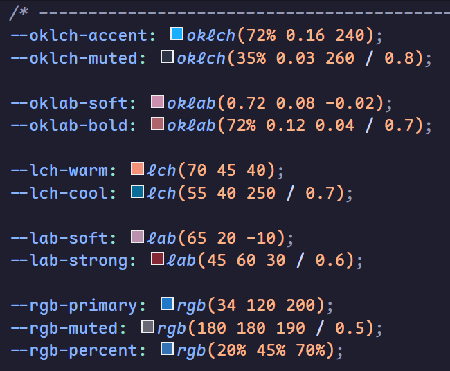
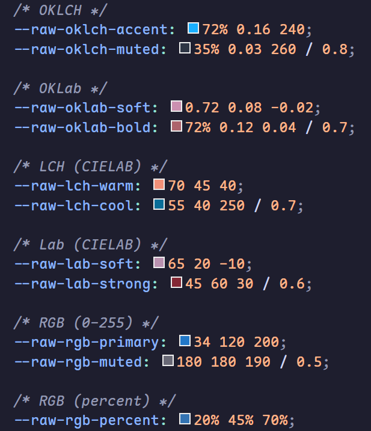

# OKLCH Shade

Preview raw color tokens in CSS variables. This extension highlights values like `97% 0.02 240` even when they are not wrapped by `oklch()`.

## Supported spaces (raw values)

- OKLCH, OKLab, LCH, Lab (CIELAB)
- RGB, HSL, HWB
- Display P3
- Hex (`#rgb`, `#rgba`, `#rrggbb`, `#rrggbbaa`) + convert options for **Hex #rrggbb** and **Hex #rrggbbaa**

## Default behavior

- Scans **CSS custom properties** (`--foo: ...;`) and shows color previews.
- When the space is ambiguous, it falls back to **OKLCH**.
- Hex previews use **auto mode** by default: they turn on only when VS Code's built-in color decorators are disabled.

## Screenshots





## Commands

- **OKLCH Shade: Convert Color Token**  
  Converts the token at the cursor (or current selection) into another format and lets you copy, replace, or **replace all**. Works for raw tokens, hex, and standard CSS functions like `oklch(...)`. The **Replace All** option ignores `@color off` directives.
- **OKLCH Shade: Convert Color Tokens (File/Folder)**  
  Batch converts tokens in the current file, a chosen folder, or the entire workspace. It respects `@convert off` directives and preserves the original style (raw tokens stay raw; function/hex values become functions unless the output is hex).
  You can also right-click a CSS/SCSS/LESS file or folder in the Explorer to run it directly.

## Inline action

You can show a small **Convert** hint next to detected colors. Toggle it with `oklchShade.inlineAction`.

## Status bar action

For users who keep inlay hints disabled, a **Convert** button is also available in the status bar. Toggle it with `oklchShade.statusBarAction`.

## Hover

Hover a token to see multiple color formats at a glance (OKLCH/OKLab/LCH/Lab/RGB/HSL/HWB/P3/Hex).

## Color picker output

The VS Code color picker offers multiple output formats (raw tokens + hex). You can select one to replace the current token.

## Ambiguous hue tokens (HSL vs HWB)

Hue-first values like `200 40% 30%` can be either **HSL** or **HWB**. By default the extension treats them as HSL. If you tokenize HWB values, set `oklchShade.ambiguousHueSpace` to `hwb` or add `@space hwb` hints.

## Disable previews

Inline (single line):

```css
--color-accent: 97% 0.02 240; /* @color off */
```

Block toggle:

```css
/* @color off */
--a: 97% 0.02 240;
--b: 60% 0.04 120;
/* @color on */
```

File wide:

```css
/* @color off:file */
```

## Space hints

Inline hint:

```css
--color-accent: 97% 0.02 240; /* @space oklch */
```

Previous-line hint:

```css
/* @space lab */
--color-accent: 97 20 -10;
```

## Configuration

```json
{
  "oklchShade.languages": ["css", "scss", "less"],
  "oklchShade.scanScope": "custom-properties",
  "oklchShade.defaultSpace": "oklch",
  "oklchShade.enableHeuristics": true,
  "oklchShade.hexPreviewMode": "auto",
  "oklchShade.inlineAction": true,
  "oklchShade.statusBarAction": true,
  "oklchShade.ambiguousHueSpace": "hsl",
  "oklchShade.variableRules": [
    { "match": "oklch", "space": "oklch" },
    { "match": "oklab", "space": "oklab" },
    { "match": "lab", "space": "lab" },
    { "match": "lch", "space": "lch" },
    { "match": "rgb", "space": "rgb" },
    { "match": "hsl", "space": "hsl" },
    { "match": "hwb", "space": "hwb" },
    { "match": "p3", "space": "display-p3" }
  ]
}
```

> Note: These are just **example mappings**.  
> You can map any prefix/pattern to any color space via `oklchShade.variableRules`.

## Disable conversion

Use `@convert off` to prevent conversions in a line or block:

```css
--raw-color-disabled: 90% 0.1 200; /* @convert off */
```

```css
/* @convert off */
:root {
  --raw-off-1: 90% 0.1 120;
  --raw-off-2: 40 50 70;
}
/* @convert on */
```
